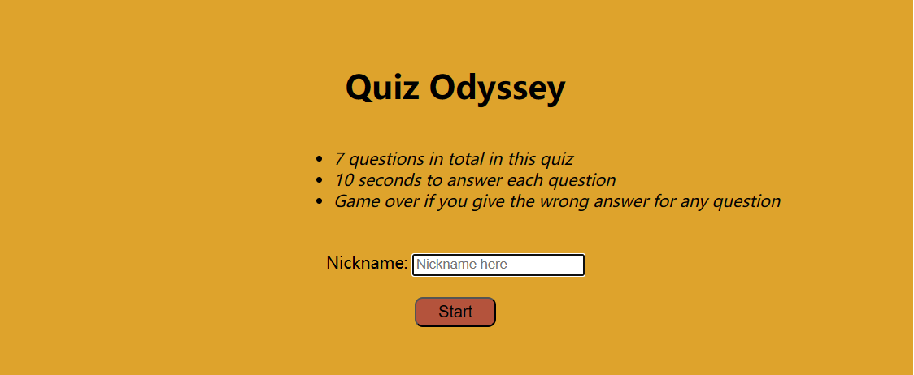

# A2 Quiz
## Description
### Solution
This HTML file sets up a basic structure for a quiz game interface. It consists of three main sections:Entry Box: Contains the form to start the quiz. It prompts the user to enter a nickname to start the game; Quiz Box: It manages the process of showing questions, receiving answers, and moving to the next question; Score Box:Displays the user's score and a table of the top 5 high scores. 
The JavaScript file (main.js) contains event listeners and functions that manage the quiz logic. The JavaScript file(functions.js) contains the functional requirements including retrieving questions and post answers from and to a server using HTTP in a RESTful manner.
### A representative picture - Entry for user to paly the game 


### How to start
1. Locally clone the repo:
  
   ```bash
   git clone git@gitlab.lnu.se:1dv528/student/zw222bb/a2-quiz.git
   ```
2. Do command in VSC terminal:

   ```bash
   npm run http-server dist
   ```
3. Open the web browser and navigate to http://localhost:9001 (It may differ in your computer) to start the quiz game.

### Rules
1. There are 7 questions in total in this quiz.
2. You have to give an answer in 10 seconds for each question.
3. Game will be over if you give the wrong answer for any question.
4. You will get the time spend showing after you answered all questions correctly.

### Linters

Command in the termimal to excute the linter for all html, css and JS files.

```bash
npm run lint
```


