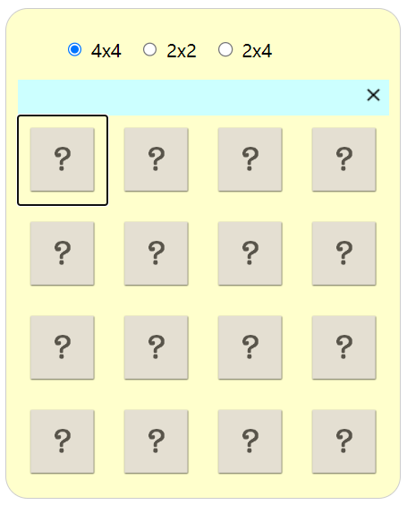
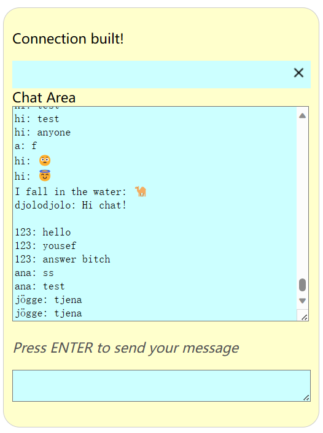
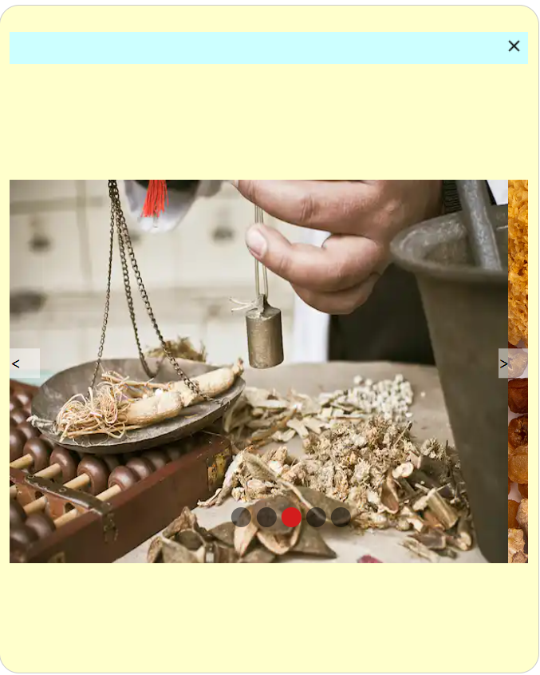

# A3 SPA
### Presentaion video link: 

```bash
https://drive.google.com/file/d/1Yg74cwuCkRdTSpeBNCesg8yGgS4YV9jv/view?usp=sharing
```

### Description
This is a single application includes 3 apps.  
&nbsp;1. Memory game  
&nbsp;2. Chat  
&nbsp;3. Slider

### Representative pictures
Memory:  
   
Chat:  

Slider：  


### How to start

1. Clone the repo:

   ```bash
   git clone git@gitlab.lnu.se:1dv528/student/zw222bb/a3-spa.git
   ```

2. Do all the commands below in terminal:

   ```bash
    npm install
    npm run dev
    npm run build
    npm run serve
    npm run http-server dist
   ```

3. Open the web browser and navigate to http://localhost:4173 (It may differ in your computer) to start this.


### Linters

Command in the termimal to excute the linter for all html, css and JS files.

```bash
npm run lint
```
