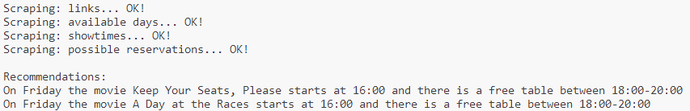
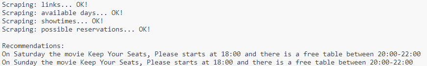

# B1 Scraper

### Description
This is a application scraping a website and present the result.


### Output pictures
Server 1:  
   
Server 2:  



### How to start

1. Clone the repo:

   ```bash
   git clone git@gitlab.lnu.se:1dv528/student/zw222bb/b1-scraper.git    
   ```

2. Do commands below in terminal:

   ```bash
    npm install
    npm start https://courselab.lnu.se/scraper-site-1
    npm start https://courselab.lnu.se/scraper-site-2
   ```
